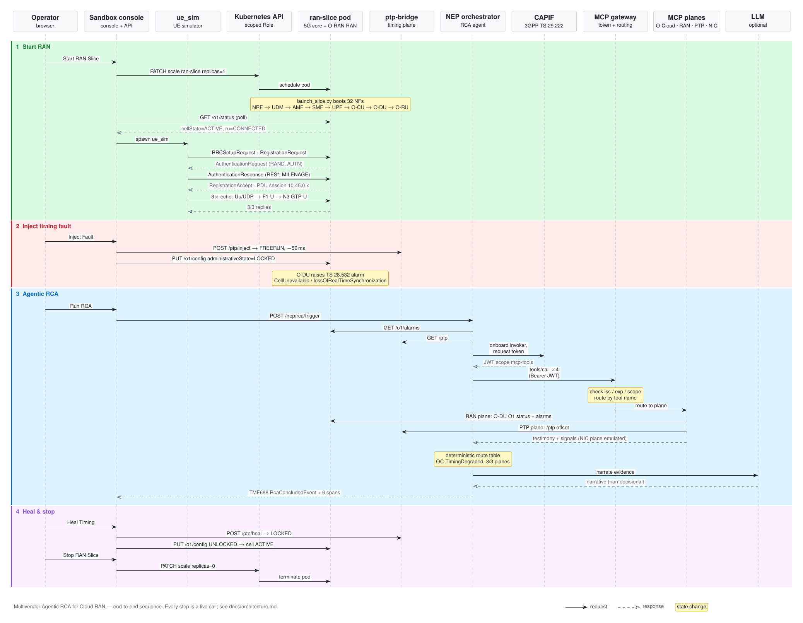

# Multivendor Agentic RCA for Cloud RAN

An on-demand **5G RAN + core sandbox** on OpenShift with a live **PTP timing-fault injection** and a governed, **agentic root cause analysis** that gathers evidence from several network "planes" over MCP, authorized by CAPIF.

You open a web console, start a RAN, watch a UE attach, inject a timing fault, and ask an agent why the cell went down. Every panel on the page reads a running component. None of the page's content is scripted.

[](https://github.com/dkypuros/multivendor-agentic-rca/blob/main/docs/diagrams/sequence.pdf)

<sub>End-to-end sequence across the 11 components. Links: [PDF (vector)](https://github.com/dkypuros/multivendor-agentic-rca/blob/main/docs/diagrams/sequence.pdf) · [LaTeX source](https://github.com/dkypuros/multivendor-agentic-rca/blob/main/docs/diagrams/sequence.tex). Rebuild: `cd docs/diagrams && pdflatex sequence.tex && pdftoppm -png -r 144 -singlefile sequence.pdf sequence`</sub>

## What the demo shows

| Step | What happens (all observable) |
|---|---|
| **Start RAN Slice** | The console scales the `ran-slice` Deployment from 0 to 1. The pod boots 32 network functions. When the O-DU reports `cellState=ACTIVE` over O1, a UE registers with real 5G-AKA (MILENAGE), opens a PDU session, and sends 3 echoes through the GTP-U tunnel. |
| **Inject Fault** | The PTP bridge goes `FREERUN` with a −50 ms offset. The console locks the cell over O1 as a protective carrier shutdown. The O-DU then raises the TS 28.532 alarm `CellUnavailable / lossOfRealTimeSynchronization` itself. |
| **Run RCA** | The NEP orchestrator ingests the O1 alarms and PTP state and gets a scoped CAPIF token. It then asks four MCP "planes" for testimony and routes the signals through a deterministic table, so no LLM is involved in the decision. It emits a TMF688 `RcaConcludedEvent`. If an LLM is configured, it narrates the evidence. |
| **Heal Timing** | PTP goes back to `LOCKED`, the cell is unlocked and back to `ACTIVE`, and the alarm clears. A second RCA finds no fault. |
| **Stop RAN Slice** | The slice scales to 0, and its CPU and memory are released. |

The first two columns of the table below matter most. This is a **software lab**, and it tells you which parts are real and which are models:

| Plane | Source of truth | Fidelity |
|---|---|---|
| RAN + 5G core | Python NFs following 3GPP/O-RAN procedures (RRC, NAS, F1AP/E1AP shapes, PFCP, GTP-U) | Real protocol logic, software-only radio (no PHY/RF) |
| UE | `ue_sim` with MILENAGE 5G-AKA | Real crypto and NAS flow, simulated radio |
| Timing (PTP) | `ptp-bridge`: ptp4l-style state and CloudEvents | Software model of a PHC, with fault injection |
| O-DU alarm | The O-DU's own O1 `/o1/alarms` | Real, raised by the O-DU |
| NIC (Intel E810) | `nic_timestamp_counters` | **Emulated**, labeled as emulated in every response |
| O-Cloud | OCM/ACM `ManagedCluster` health through kubectl | Real **if** ACM plus a kubeconfig are provided. Otherwise the plane reports "unavailable" rather than inventing evidence |
| LLM narrative | Any OpenAI-compatible endpoint | Optional. Without one, a labeled template summarizes the same evidence |

## Quick start

**Assumptions:** an OpenShift 4.x cluster, `oc` logged in as a user who can create a project, and outbound access from builds to `registry.access.redhat.com` and PyPI. Full list: [docs/deployment.md](docs/deployment.md#prerequisites).

```bash
git clone https://github.com/<you>/multivendor-agentic-rca.git && cd multivendor-agentic-rca

oc new-project multivendor-rca
oc apply -k deploy/openshift                                   # 10 Deployments, Services, RBAC, Route, BuildConfig
oc start-build mvrca --from-dir=. --follow                     # build the one image every component runs
oc rollout restart deployment -l app.kubernetes.io/part-of=multivendor-rca

oc get route ran-sandbox -o jsonpath='https://{.spec.host}{"\n"}'   # open this in a browser
```

Verify it the same way the browser drives it:

```bash
python3 tests/smoke_route.py https://$(oc get route ran-sandbox -o jsonpath='{.spec.host}')
# ... ALL GREEN
```

Optional: point the RCA at an LLM ([details](docs/deployment.md#optional-connect-an-llm)).

```bash
oc create secret generic llm-endpoint \
  --from-literal=AI_GATEWAY_URL=http://<vllm-or-litellm-host>:<port> \
  --from-literal=LLM_MODEL=<model-id> --from-literal=LLM_API_KEY=<key-or-none>
oc rollout restart deployment/nep-orchestrator
```

## Documentation

| Doc | For |
|---|---|
| [docs/deployment.md](docs/deployment.md) | Prerequisites, step-by-step install, LLM, GitOps, upgrade, uninstall, troubleshooting |
| [docs/demo-walkthrough.md](docs/demo-walkthrough.md) | A 20-minute presenter script: what to click, what appears, what to say |
| [docs/architecture.md](docs/architecture.md) | Components, call flows, the RCA pipeline, design decisions |
| [docs/reference.md](docs/reference.md) | HTTP APIs, configuration (env vars), ports |

## Try it without a cluster

The whole use case also runs on a laptop. The only fake is a stub Kubernetes API, whose "scale" launches the real RAN slice as a local process:

```bash
pip install pyyaml            # the MCP gateway's only third-party dependency
python3 tests/e2e_local.py    # starts every component, drives Start/Inject/RCA/Heal/Stop, 34 checks
```

## Repository layout

```
deploy/openshift/     Kustomize: one namespace, every component (oc apply -k)
deploy/argocd/        Optional Argo CD Application
Containerfile         UBI9 Python 3.12 image shared by all components
src/                  The code, laid out as in the upstream telco-lab repo so imports resolve
  services/ran/sandbox_controller.py     the console + API
  deploy/docker/launch_slice.py          boots the RAN slice (profile "ran" of tools/stackctl.py)
  services/core/…, services/ran/…        5G core NFs and the O-RAN split RAN
  services/ue_sim/ue_sim.py              UE simulator
  services/smo/ptp_bridge.py             timing plane
  services/orchestrator/nep_orchestrator.py   RCA agent
  extensions/sheldon/agentic/            MCP gateway + plane servers
tests/                e2e_local.py (no cluster), smoke_route.py (deployed), stub_kube.py
docs/                 deployment, demo walkthrough, architecture, reference; diagrams/ (LaTeX sequence diagram)
```

## Status

Verified on **OpenShift 4.22.1** on 28 Sep 2026, using exactly the steps above:
- `tests/smoke_route.py` passes against the deployed Route, with and without an LLM. The LLM tested was Llama 3.1 8B served by vLLM on CPU.
- `tests/e2e_local.py` passes locally on Python 3.12.

## Provenance

Extracted from the `telco-lab` monorepo (the `gitea-oberon/` tree, Gitea commit `a1bb39e`). This repo keeps only the code this use case imports: 73 files out of about 1,400.

It also improves on the monorepo's RCA path:
- The RAN plane testifies from the O-DU's O1 alarms.
- Plane evidence and the narrative are built from the tool results that actually came back, never from fixed strings.
- The emulated NIC plane follows the real PTP state.
- LLM endpoint, model and timeouts are configurable.
