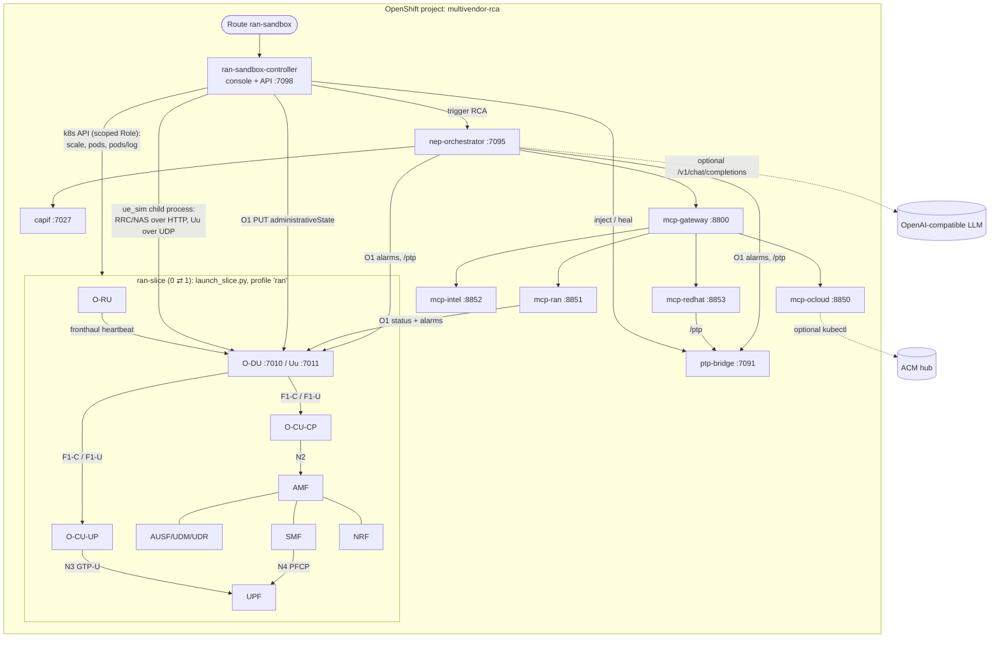
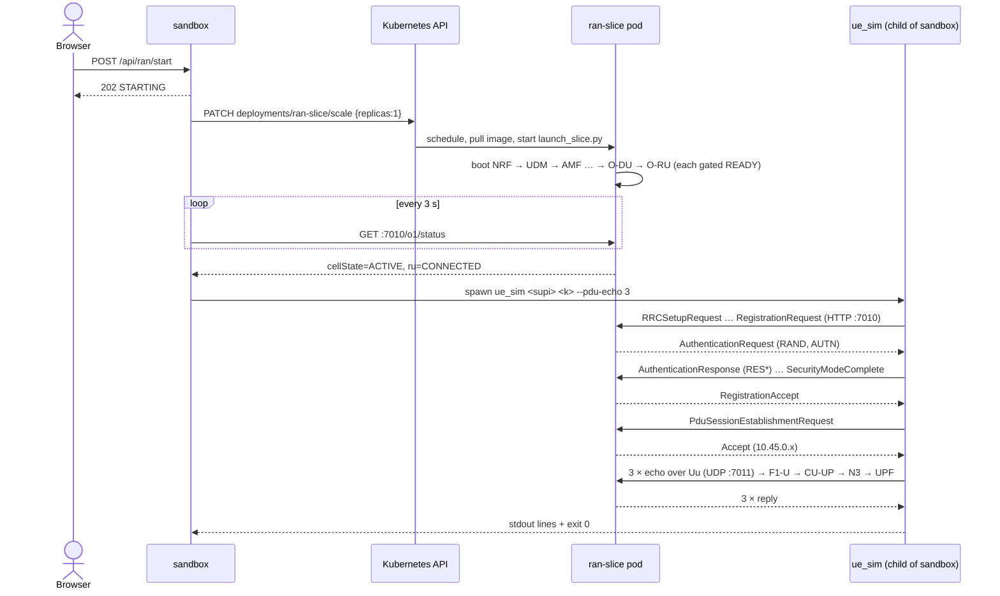
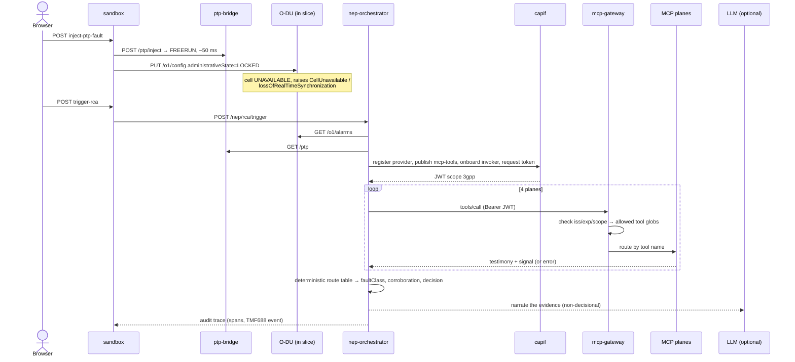

# Architecture

## Components



| Component | Code | What it is |
|---|---|---|
| Sandbox console | `src/services/ran/sandbox_controller.py` | Stdlib HTTP server. It serves the page and the `/api/ran/*` API, scales `ran-slice` through the in-cluster Kubernetes API, runs `ue_sim` as a child process, and merges its own action log with the slice pod's stdout. |
| RAN slice | `src/deploy/docker/launch_slice.py` + `src/tools/stackctl.py` (profile `ran`) | A PID-1 supervisor that boots 32 NFs in dependency order and gates each on readiness: 5G core, IMS, and the O-RAN split RAN. |
| UE | `src/services/ue_sim/ue_sim.py` | RRC setup, then NAS registration with 5G-AKA RES* computed with MILENAGE (TS 35.206 / TS 33.501 A.4), security mode, a PDU session, and user-plane echoes. |
| Timing plane | `src/services/smo/ptp_bridge.py` | ptp4l-style state (offset, port state, clock class), CloudEvents shape, `/ptp/inject` and `/ptp/heal`. |
| RCA agent | `src/services/orchestrator/nep_orchestrator.py` | The six-span pipeline below. |
| CAPIF | `src/services/core/capif/capif.py` | TS 29.222 provider registration, API publish, invoker onboarding and scoped tokens. |
| MCP gateway | `src/extensions/sheldon/agentic/gateway.py` | JSON-RPC MCP front door. It verifies the CAPIF token's issuer, expiry and scope, maps the scope to tool globs, and routes by tool name. |
| MCP planes | `src/extensions/sheldon/agentic/mcp_*.py`, `*_tools.py` | `ocloud` (ACM ManagedClusters), `ran` (O-DU O1), `redhat` (PTP), `intel` (NIC, emulated) |

## Flow 1: Start RAN



`Stop` is a single `PATCH … {replicas:0}`. The whole slice, every NF included, is one pod, so the stop releases all of it.

## Flow 2: Fault and RCA



## The RCA pipeline (six spans)

| # | Span | Input | Output |
|---|---|---|---|
| 1 | `O-RAN.O1.FM.Alarm_Ingest` | O-DU `/o1/alarms`, PTP `/ptp` | The alarms and clock state recorded as span attributes. `ERROR` if either is unreachable. |
| 2 | `3GPP.CAPIF.Security_Authz` | CAPIF | Invoker id and scoped token. `ERROR` (and no tool calls) if CAPIF fails. |
| 3 | `O-RAN.R1.MCP_Tool_Execution` | Four tool calls through the gateway | One testimony per plane: `answered`, `emulated`, `signals`, and one line of `evidence` built from the returned data. `PARTIAL` if any plane failed. |
| 4 | `O-RAN.NonRT_RIC.Deterministic_Router` | All signals | The first matching row of `ROUTE_TABLE` gives `faultClass`. Planes carrying a signal of that class are counted; **≥ 3 gives `APPLY (auto)`, otherwise `HOLD — below the bar, a human signs`**. |
| 5 | `Enterprise.AI.LLM_Synthesis` | Decision + testimony | LLM narrative, or a labeled template if there's no LLM. **Never feeds back into span 4.** |
| 6 | `TMForum.TMF688.Audit_Event_Emission` | Everything | `RcaConcludedEvent` stored in `/nep/audit/*` (in memory, last 50). |

Route table excerpt (`nep_orchestrator.py`), ordered from deepest plane to shallowest:

```
bmh_powered_off → OC-NodeDown            managedcluster_unavailable → OC-ClusterUnavailable
ptp_offset_exceeded / ptp_not_locked / nic_firmware_suspect / du_sync_loss_alarm → OC-TimingDegraded
service_alarm_raised / service_inactive → OC-ServiceDegraded
```

"Automatic" is a verdict label only. The orchestrator executes nothing; remediation in this lab is the **Heal Timing** button.

## Design decisions

**One co-located slice pod, not one pod per NF.** Every NF registers `127.0.0.1` with the NRF and dials its peers on loopback. That's the upstream stack's current contract (upstream issue #61 tracks the split). Per-NF pods can't reach each other. Co-locating them in one pod (`launch_slice.py`) is the supported way to run a *connected* RAN and core. As a bonus, it gives a single, atomic unit to start and stop.

**On-demand scaling through the Kubernetes API.** The RAN is the only heavy part: about 420 MiB with 32 processes. It runs only between Start and Stop. The console's ServiceAccount can scale exactly one Deployment (`resourceNames: [ran-slice]`) and read pods and logs in its own namespace, nothing else.

**The UE runs beside the console, not in the slice.** The sandbox spawns `ue_sim` in its own pod and reaches the O-DU through the `ran-slice` Service: HTTP for RRC/NAS, UDP 7011 for the user plane. This proves the service path works across pods rather than on loopback.

**Fault = PTP state plus O1 lock.** The PTP bridge models the clock. The O-DU has no PTP servo, so the console applies the O-DU's protective action explicitly through its standard O1 configuration interface (TS 28.541 `administrativeState`). Cell state and the TS 28.532 alarm then come from the O-DU itself.

**Decision and narration are separated.** Only span 4 decides, from a fixed table. The LLM sees the evidence and the decision after the fact, so a model failure or hallucination can't change the outcome. It's also why the demo works with no LLM at all.

**Honest planes.** Each plane testifies from what its tool actually returned, or says it's unavailable. The NIC plane is emulated and says so in every response. Its fault follows the real PTP state (`NIC_FAULT_MODE=follow-ptp`), so a healthy system produces a healthy RCA.
